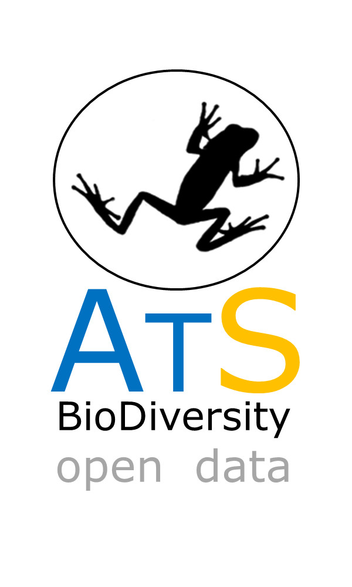

# ATLANTIC AMPHIBIANS

Mirrored from <https://github.com/mauriciovancine/ATLANTIC-Amphibians>

ATLANTIC-AMPHIBIANS dataset is part of the ATLANTIC SERIES, on which research teams are compiling biodiversity information of  Atlantic Forest biome. 

Vancine, M. H., K. S. Duarte, Y. S. Souza, J. G. R. Giovanelli, P. M. M. Sobrinho, A. López, R. P. Bovo, F. Maffei, M. B. Lion, J. W. Ribeiro-Júnior, R. Brassaloti, C. Ortiz, H. O. Sawakuchi, J. Bertoluci, L. R. Forti, P. Cacciali, C. F. B. Haddad, and M. C. Ribeiro. *ATLANTIC AMPHIBIANS. A Dataset of Amphibian Communities from the Atlantic Forests of South America.* 

### The datapaper was ACCEPTED in ECOLOGY journal, and will be out in May/2018

In the ATLANTIC AMPHIBIANS we compiled information on amphibian communities of Atlantic Forest Biome. A total of 389 bibliographic references from 1940 to 2017 were used as source of data. The database includes 17,619 records, which represents 528 species recorded at 1,163 georeferenced sites. About 82% were classified thru endemism criterion. Active surveys was the most frequent method (82.1%). Species richness were 15.2 ± 11.3 SD, with low dominance in the communities, and only 10 species occurred about 26% of communities.

 

**FIGURE 1.** Distribution of the study sites in the ATLANTIC AMPHIBIANS dataset. The limit of Atlantic Forest Biome is according Muylaert et al. (in review). 

Mirrored from <https://github.com/mauriciovancine/ATLANTIC-Amphibians>