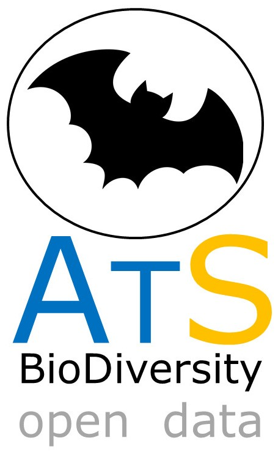

# ATLANTIC SERIES

## ATLANTIC BATS: a data set of bat communities from the Atlantic Forests of South America	

#####  MUYLAERT ET AL. 2017. ECOLOGY JOURNAL: doi: 10.1002/ecy.2007 - http://onlinelibrary.wiley.com/doi/10.1002/ecy.2007/suppinfo

Last update: June 2020

**The updated version of **ATLANTIC BATS** can be accessed [here](https://github.com/LEEClab/Atlantic_series/blob/master/ATLANTIC_BATS/DATASET/2018_02_d21/ATLANTIC_BATS_2020_comp.xlsx) in this **ATLANTIC SERIES** Github repository.*

**The original dataset is fully available at ECOLOGY repository**. 

Bats are the second most diverse mammal order and they provide vital ecosystem functions and services. ATLANTIC BATS data has 135 quantitative studies carried out in 205 sites, with more than 90,000 captures of 98 bat species. Six species occurred in more than 50% of the communities: Artibeus lituratus, Carollia perspicillata, Sturnira lilium, Artibeus fimbriatus, Glossophaga soricina, and Platyrrhinus lineatus. 

CONTACT PERSON: Renata Muylaert <renatamuy@gmail.com>, Mauro Galetti <galetti@mac.com> and Milton Cezar Ribeiro <miltinho.astronauta@gmail.com>

 

