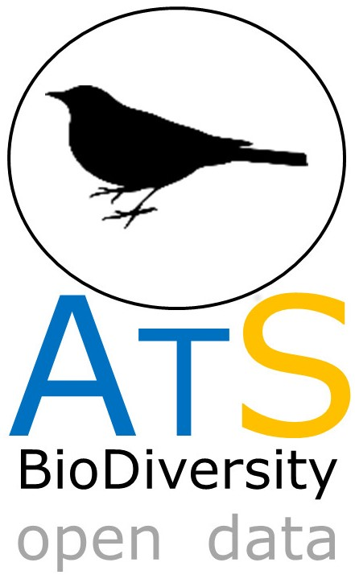

# ATLANTIC BIRDS

***Here we share the updated version ATLANTIC BIRDS Data Paper dataset. Please check the original version of the Data Paper on ECOLOGY journal:***

 [Hasui, E. , J. P. Metzger., R. G. Pimentel., L. F. Silveira., A. A. A. Bovo, A. C. Martensen, A. Uezu, 
A. L. Regolin, A. A. B. Oliveira, C. A. F. R. Gatto, C. Duca, C. B. Andretti, C. Banks-Leite, D. Luz, 
D. Mariz, E. R. Alexandrino, F. M. Barros, F. Martello, I. M. S. Pereira, J. N. Silva, K. M. P. M. B. Ferraz, 
L. N. Naka, L. Anjos, M. A. Efe, M. A. Pizo, M. Pichorim, M. S. S. Gonçalves, P. H. C. Cordeiro, R. A. Dias, 
R. L. Muylaert, R. C. Rodrigues, T. V. V. Costa, V. Cavarzere, V. R. Tonetti, W. R. Silva, C. N. Jenkins, 
M. Galetti, and M. C. Ribeiro. 2017. **ATLANTIC BIRDS: a dataset of bird species from the Brazilian Atlantic Forest.** 

**ECOLOGY JOURNAL: doi:10.1002/ecy.2119 - http://onlinelibrary.wiley.com/doi/10.1002/ecy.2119/full**

ATLANTIC-BIRDS dataset is part of the **ATLANTIC SERIES**, on which research teams are compiling biodiversity information of Atlantic forest biome. 

This dataset is composed of 183,814 avian records (150,423 of occurrence data and 33,391 that include abundances)  of 832 species in the Atlantic Forest of Brazil. It is compiled using four main sources of data 
(museum collections, on-line databases, published sources, and unpublished reports), that were recorded during the last two centuries (from 1815 to 2017). The dataset included data that are spread around the world (but mainly in Brazilian museums) or are published in Portuguese or remain as gray literature with restricted access. 

The dataset is accompanied by a descriptive analysis of the main patterns of avian records (with qualitative and  quantitative datasets) and information of the gap in knowledge about spatial and temporal distribution of birds in the  Atlantic Forest. We also highlight some species that need special conservation attention due to the low frequency of  records in recent years. All this information can be used for macroecological studies to explore population and  community’ structure, and calculate different composition metrics, such as species diversity, richness, and species relative abundance (captures/100 net hours, abundance per number of samples (IPA), or sight/hours) for 576 communities. 
For some localities, it is possible to investigate temporal dynamics of bird species distribution from 1815 to 2017 (historical vs. current records). In addition, it is interesting to foster conservation strategies in this biodiversity hotspot.

**The original dataset is fully available at ECOLOGY repository**. 
*Updated version of **ATLANTIC BIRDS** can be accessed in this **ATLANTIC SERIES** Github repository.*

CONTACT PERSON: Erica Hasui <ericahasui@gmail.com> and Milton Cezar Ribeiro <miltinho.astronauta@gmail.com>

 

## Class I. Data set descriptors
### A. Data set identity:

Title: ATLANTIC BIRDS: a dataset of bird species from the Brazilian Atlantic Forest

### B. Suggested Data Set Identity Codes: 

ATLANTIC_BIRDS_species.csv, ATLANTIC_BIRDS_refs.csv, ATLANTIC_BIRDS_quantitative.csv, and ATLANTIC_BIRDS_qualitative.csv.

### C. Data set description:
The dataset is restricted to the Brazilian Atlantic Forest, whose limits was defined by Ribeiro et al. (2009), 
and covers tropical and subtropical forests in Brazil. It is composed of 183,814 avian records 
(150,423 of occurrence data and 33,119 that include abundances) from four main sources: museum collections, 
on-line databases, published sources, and unpublished reports. Published records include 509 references, 62% (316) 
represent peer- reviewed articles, 30% (148) are graduate studies (thesis and dissertations), and ca. 7% (43) 
represent unpublished reports, mostly environmental consulting studies. The year of sampling records varied 
from 1815 to 2017. We catalogued 4,122 localities that include 832 bird species, 66 of which are endangered and 
54 are near threatened. 

## Principal Investigators

Érica Hasui  
Universidade Federal de Alfenas (UNIFAL-MG), Instituto de Ciências da Natureza, Rua Gabriel Monteiro da Silva, 700, 
Alfenas, MG, 37130-000, Brazil.

Jean Paul Metzger, Rafael Guerra Pimentel  
Instituto de Biociências, Universidade de São Paulo (USP-SP), Rua do Matão, Travessa 14, 321, Butantã, São Paulo, 
SP, 05508-900, Brazil.

Luís Fábio Silveira  
Museu de Zoologia da Universidade de São Paulo, Avenida Nazaré 481, Ipiranga, 04263-000, São Paulo, SP, Brazil

Milton Cezar Ribeiro, Mauro Galetti  
Universidade Estadual Paulista (UNESP), Instituto de Biociências, Departamento de Ecologia, CP 199, 
Rio Claro, SP, 13506-900, Brazil.

