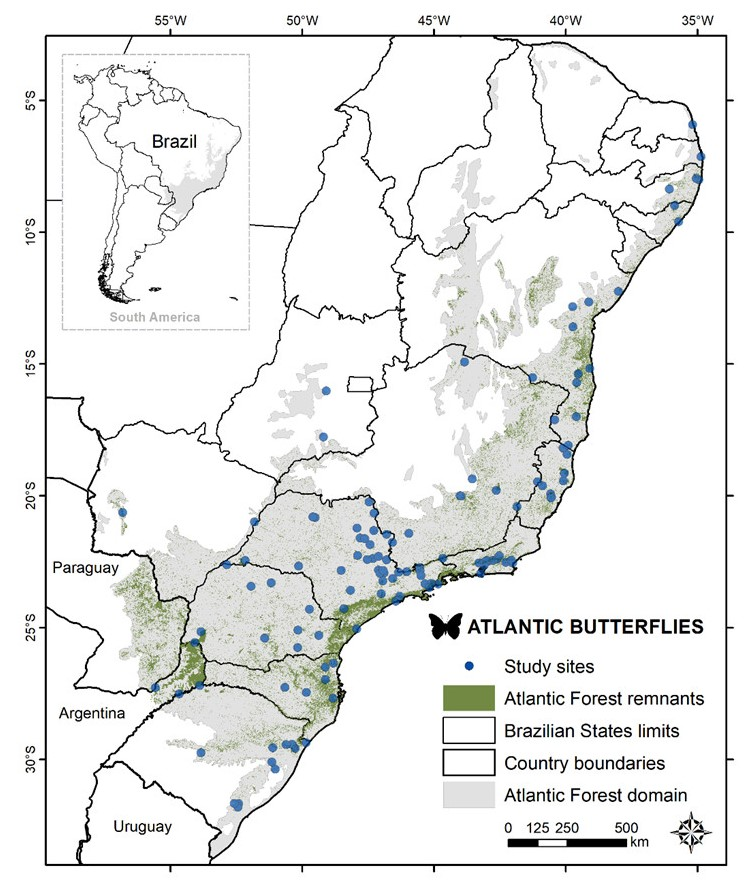

# ATLANTIC SERIES
--------------------------------------------------------
### **ATLANTIC-BUTTERFLIES: DATASET OF FRUIT-FEEDING BUTTERFLY COMMUNITIES FROM THE ATLANTIC FORESTS**

##### JESSIE, FREITAS et al. in review et ECOLOGY journal, April 2018

We compiled species occurrence information about well-sampled fruit-feeding butterfly communities from more than a hundred localities on Atlantic Forest biome. The present dataset contains 279 fruit-feeding butterfly species, representing 122 communities distributed in the Atlantic Forest in Brazil and neighbor Argentina. We prioritized the reliability of registers, thus confirming all species records and updating all taxonomic nomenclature. The ATLANTIC BUTTERFLIES dataset represents a major effort to compile species lists of fruit-feeding butterfly communities for the Neotropical region, aiming to fill a knowledge gap about distribution of this indicator group in the Atlantic Forest hotspot.

All data will be available in ECOLOGY repository. This mirror GITHUB repository will maintain updated versions of dataset, as well as MANY EXTRA INFORMATION generated using ATLANTIC BUTTERFLIES dataset.  

 

