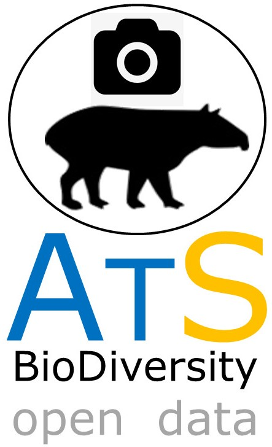
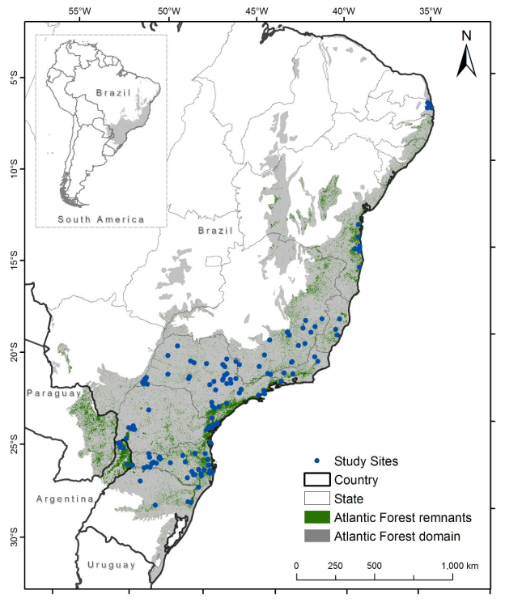

# ATLANTIC SERIES

## ATLANTIC CAMTRAP: a dataset of medium and large terrestrial mammal communities in the Atlantic Forest of South America	

#####  LIMA ET AL. 2017. ECOLOGY JOURNAL: doi: 10.1002/ecy.1998 - http://onlinelibrary.wiley.com/doi/10.1002/ecy.1998/suppinfo

Cameratrap data is one of the most common method for acquire medium and large-sized mammal´s data. ATLANTIC CAMTRAP encompass data on 170 quantitative surveys conducted on 144 area. A total of 53,438 unique records about 83 species are available for the entire Atlantic Forest. These species refers to marsupuals (n=10 species), rodents (15), carnivores (20), ungulates (8) and armadillos (6). 

 

