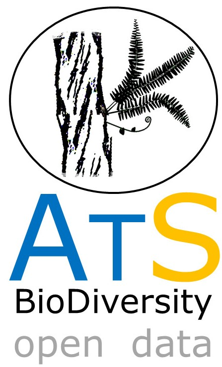

# ATLANTIC SERIES
--------------------------------------------------------
### ***ATLANTIC-EPIPHYTES A DATASET OF HOLO/HEMIEPIPHYES SPECIES FROM THE ATLANTIC FOREST OF WOUTH AMERICA***

RAMOS  et al. in prep to be submitted to ECOLOGY journal, April 2018

 Here, we compiled a dataset with 74,739 of Epiphytes records, for Brazilian, Argentina and Paraguay sites, covering the entire Atlantic Forest Hotspot. Published data added 150 references and came mostly from peer reviewed articles (71%), followed by thesis (24%) and books (5%). The sample unit most common in the studies was tree (5,446 records), followed by plot (2,008) and transect (1,072). 

All data will be available in ECOLOGY repository. This mirror GITHUB repository will maintain updated versions of dataset.  

 

