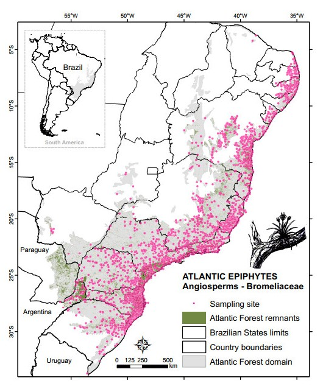

# ATLANTIC SERIES
--------------------------------------------------------
### ***ATLANTIC-EPIPHYTES A DATASET OF HOLO/HEMIEPIPHYES SPECIES FROM THE ATLANTIC FOREST OF WOUTH AMERICA***

RAMOS  et al. in prep to be submitted to ECOLOGY journal, April 2018

Here, we compiled a dataset of 85000 georeferenced locations of XXX SPECIES. 

For the epiphytes records, the most abundant species were XXX, XXX, XXX, XXX and XXX.  The Angiosperms group represented X% of the records, followed by Ferns (X e %), Lycophyte (X e %), Lichens (X e %), Fungi (X e %) and Mosses (X e %). In Angiosperms the most representative families were Bromeliaceae (X e %), Orchidaceae (X e %), Piperaceae (X e %) and Cactaceae (X e %). Within Bromeliaceae the main generas were XXXX (X e %), XXXX (X e %) and XXXX (X e %). In Orchidaceae the principal were  XXXX (X e %), XXXX (X e %) and XXXX (X e %)(X e %). The dominance was low in the Ferns group with XXXX (X e %), XXXX (X e %) and XXXX (X e %) followed by Lycophyte with XXXX (X e %), XXXX (X e %) and XXXX (X e %). In Lichens, Fungi and Mosses groups, the most dominants families were XXX, XXX, XXX, and XXX.

	For the epiphytes species, the most abundant were XXX, XXX, XXX, XXX and XXX. The Angiosperms group represented X% of the records, followed by Ferns (X e %), Lycophyte (X e %), Lichens (X e %), Fungi (X e %) and Mosses (X e %). In Angiosperms the most representative families were Bromeliaceae (X e %), Orchidaceae (X e %), Piperaceae (X e %) and Cactaceae (X e %). Within Bromeliaceae the main generas were XXXX (X e %), XXXX (X e %) and XXXX (X e %). In Orchidaceae the principal were  XXXX (X e %), XXXX (X e %) and XXXX (X e %)(X e %). The dominance was low in the Ferns group with XXXX (X e %), XXXX (X e %) and XXXX (X e %) followed by Lycophyte with XXXX (X e %), XXXX (X e %) and XXXX (X e %). In Lichens, Fungi and Mosses groups, the most dominants families were XXX, XXX, XXX, and XXX.
	For the forophytes the most representative families were XXXX, XXXX and XXXX. The principal species were XXXX, XXXXX, XXXX and XXXX
All data will be available in ECOLOGY repository. This mirror GITHUB repository will maintain updated versions of dataset.  

 

