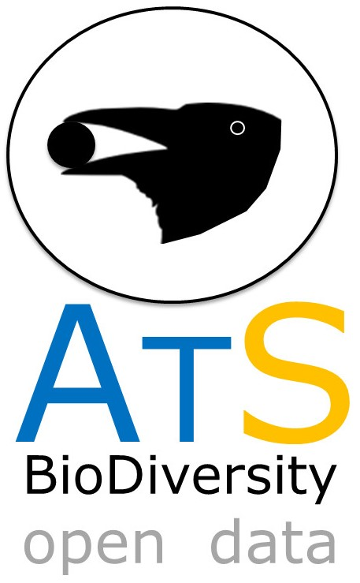

# ATLANTIC SERIES
--------------------------------------------------------
### ***ATLANTIC FRUVIGORY: A PLANT-FRIGIVORE INTERACTION DATA SET FOR THE ATLANTIC FOREST***

BELLO et al. ECOLOGY 98(6), 2017, pp. 1729: http://onlinelibrary.wiley.com/doi/10.1002/ecy.1818/suppinfo 

In the fundation paper of ATLANTIC SERIES we compiled 8,320 PLANT-FRUGIVORY interactions for the Atlantic Forest biodiversity hotspot. A total of 331 vertebrate species [including 232 birds, 90 mammals, 5 fishes, 3 reptiles and 1 amphibian] were recorded interacting with 788 plant species in the Atlantic Forest Biome. 

All data is available in ECOLOGY repository. This mirror GITHUB repository will maintain updated versions of dataset.  

 

