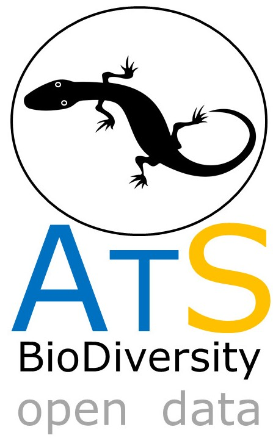

# ATLANTIC SERIES
--------------------------------------------------------
### **ATLANTIC-LIZARDS: A DATASET OF SNAKE ASSEMBLAGES IN THE  ATLANTIC FORESTS**

### **In this datapaper we aims to compile data (published or raw data) on LIZARD communities from the Atlantic Forests. If you want more information, please contact us.**

This compilation is coordinated by André L. G. Carvalho/University of Texas at Arlington ([andreluizherpeto@gmail.com](mailto:mariormoura@gmail.com)), Renato Recoder/USP (renatorecoder@gmail.com); Sergio M. de Souza/USP (sergio.bogao@gmail.com), Adriana Jeckel/USP ([amjeckel@gmail.com](mailto:amjeckel@gmail.com)), Rafael Benetti/UFMT (rafaparedero@gmail.com), Henrique C. Costa/UFMG ([ccostah@gmail.com](mailto:ccostah@gmail.com)), Mario R. Moura/Yale University ([mariormoura@gmail.com](mailto:mariormoura@gmail.com)) and Milton Ribeiro/UNESP-Rio Claro ([miltinho.astronauta@gmail.com](mailto:miltinho.astronauta@gmail.com)).

k

