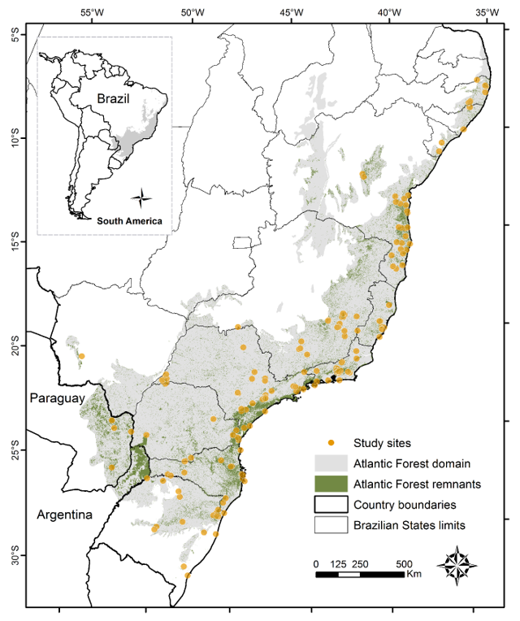

# ATLANTIC SERIES

## ATLANTIC SMALL-MAMMALS: a dataset of communities of rodents and marsupials of the Atlantic Forests of South America	

##### BOVENDORF ET AL. 2017. ECOLOGY JOURNAL: doi: 10.1002/ecy.1893 - http://onlinelibrary.wiley.com/doi/10.1002/ecy.1893/suppinfo

In the SMALL-MAMMALS datapaper, we compiled a broad range of small rodents and marsupials that occurs within Atlantic Forests. An exaustive survey on 136 references (both peer-reviewed and gray literature) allowed us to obtain small mammal data for 300 locations covering the entire Atlantic Forest. A total of 53,518 records about 124 species (30 marsupials and 94 rodents) are fully available for the biome. 

 

