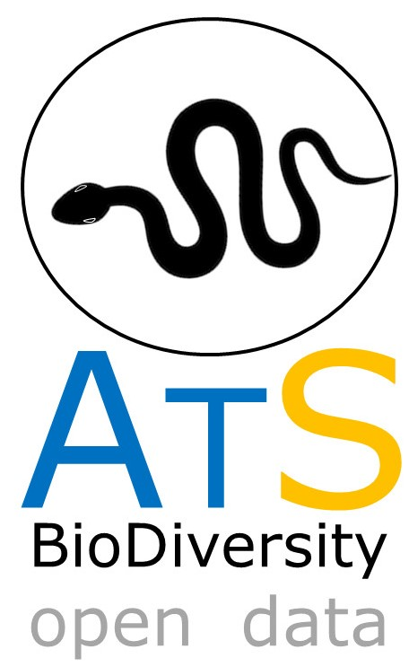

# ATLANTIC SERIES
--------------------------------------------------------
### **ATLANTIC-SNAKES: A DATASET OF SNAKE ASSEMBLAGES IN THE  ATLANTIC FORESTS**

###In this datapaper we aims to compile data (published or raw data) on snakes communities from the Atlantic Forests. If you want more information, please contact.###

This compilation is coordinated by: Mario R. Moura/Yale University ([mariormoura@gmail.com](mailto:mariormoura@gmail.com)), Henrique C. Costa/UFMG ([ccostah@gmail.com](mailto:ccostah@gmail.com)), Marco Antônio Peixoto/UFV ([marco.peixotom@gmail.com](mailto:marco.peixotom@gmail.com)), Jhonny Guedes/UFV ([jhonnyguds@gmail.com](mailto:jhonnyguds@gmail.com)), Thaís B. Guedes/USP ([thaisbguedes@yahoo.com.br](mailto:thaisbguedes@yahoo.com.br)), and Milton Ribeiro/UNESP-Rio Claro ([miltinho.astronauta@gmail.com)](mailto:miltinho.astronauta@gmail.com)

