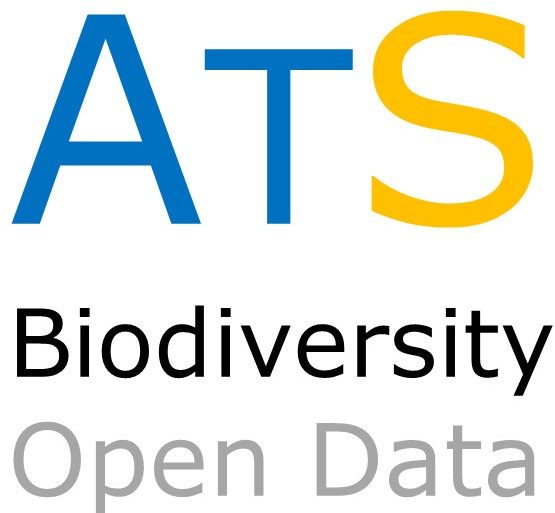

# ATLANTIC SERIES: Data on the richest neotropical hotspot
--------------------------------------------------------
### ***The ATLANTIC SERIES aims to make public all sort of Biodiversity data for species occurrence, populantion and community levels. This initiative is lead by Profs. Mauro Galetti and Milton Ribeiro (UNESP, Rio Claro, São Paulo, Brazil)***

The tropical and subtropical forests along the coast and interior parts of South America used toone of the largest forests in the world with more than 1.5 million km2, occurring in Brazil, Argentina and Paraguay. The luxury biodiversity andbeautiful landscape attracted the attention of Darwin, Marcgrave, Von Spix, VonMartius, Lund and many other naturalists. Because of the complex historicalorigin, and a large variation in topography and rainfall, the Atlantic forest createsan ideal place for evolution of species. The Atlantic forest hold 20,000 species oftrees, 850 of birds, 260 of mammals, 280 amphibians and 200 reptiles, with highlevels of endemism. Today only 12% of the forest remains, mostly in smallfragments or as secondary growth forest. Although highly fragmented, the levelof global extinction is surprisingly low, only four bird species are consideredextinct in the wild. Thanks to financial incentives from Brazilian (CNPq,CAPES, FAPESP, Fundação O Boticário de Proteção à Natureza among others) and international institutions a large volume of scientific information has been collected about the biodiversity of the Atlantic forest, but most of them werein Portuguese or unavailable for wide audience. 

The ATLANTIC SERIES holds a series of data paper about community composition anddistribution of plants and animals from one of the most diverse region in theworld. These papers can be a fundamental tool for scientists, but also policymakers.

 All data will be available in ECOLOGY repository. This mirror GITHUB repository will maintain updated versions of dataset.

**Mauro Galetti and Milton Cezar Ribeiro**

Coordinators ofthe Atlantic data papers

Universidade Estadual Paulista (UNESP)

Instituto de Biociências, Departamento de Ecologia

13506-900 Rio Claro, São Paulo, Brazil

