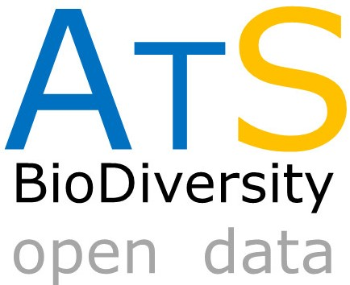

# ATLANTIC SERIES: Data on the richest neotropical hotspot
--------------------------------------------------------
### **MEDIA COVERAGE about ATLANTIC SERIES**

 **PRESS:**

[RevistaFAPESP – pdf version – 2018/05/21](http://revistapesquisa.fapesp.br/wp-content/uploads/2018/05/044-047_aves-e-mamiferos_267.pdf)

[RevistaFAPESP – online version – 2018/05/21](http://revistapesquisa.fapesp.br/2018/05/21/as-metamorfoses-da-mata-atlantica/?cat=ciencia)

 

**VIDEO:**

[Atlantic SMALL MAMMALS on Youtube](https://www.youtube.com/watch?v=Ohl3i26iPnA)

[Atlantic CAMTRAPS on Youtube](https://youtu.be/zay_4-BqWJc)

[Atlantic BATS onYoutube](https://www.youtube.com/watch?v=C1PLD7fZe7c)

 

